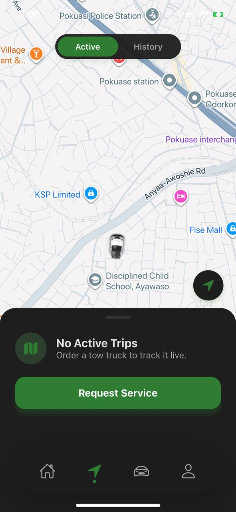

# 🚗 TowFlow — Smart Towing & Roadside Assistance System

TowFlow is a full-stack, real-time towing and dispatch platform designed to connect users in need of roadside assistance with nearby tow truck drivers efficiently and reliably.

It addresses a critical real-world problem: **slow and uncoordinated emergency response during vehicle breakdowns**, by enabling instant service requests, live tracking, and seamless communication between users, drivers, and administrators.

---

## ⚡ Key Features

* 📍 Real-time driver tracking using Mapbox
* 🚨 Instant towing request and dispatch system
* 📱 Dedicated mobile apps for users and drivers
* 🧭 Smart job assignment and navigation
* 📊 Admin dashboard for monitoring and analytics
* 🔐 Secure authentication with JWT

---

# 📱 User App (Customer Experience)

The TowFlow user application allows customers to request roadside assistance, track drivers in real-time, and manage their vehicles and services.

---

### 🏠 Home & Request Flow


---

### 🔧 Service Selection




---

### 🚗 Vehicle Management


---

### 📍 Live Tracking


---

### 👤 Profile & Settings


---

### 🆘 Support System


---

> ⚠️ Note: The user module is actively under development and continuously improving.

---

## 🔄 User Workflow

1. User selects issue (flat tire, fuel, lockout, etc.)
2. System fetches nearby service providers
3. User selects preferred provider
4. Request is sent to backend
5. Driver is assigned
6. User tracks driver in real-time
7. Service is completed

---

# 📱 Driver App (In Development)

Below are screenshots from the TowFlow driver application.

### 🚗 Driver Dashboard & Map View


---

### 👤 Profile & Account


---

### 🚚 Vehicle & Documents


---

### 📋 Menu


---

## 🔄 Driver Workflow

1. Driver goes online
2. System scans for nearby requests
3. Driver accepts job
4. Navigation + tracking begins
5. Trip completed and earnings updated

---

## 🧭 System Architecture (Production-Oriented)

```
                  ┌──────────────────────────┐
                  │     Mobile Clients       │
                  │  (User & Driver Apps)   │
                  └──────────┬──────────────┘
                             │ REST / JSON
                             ▼
                  ┌──────────────────────────┐
                  │      Backend API         │
                  │   Node.js + Express      │
                  └──────────┬──────────────┘
                             │
        ┌────────────────────┼────────────────────┐
        ▼                    ▼                    ▼
┌───────────────┐   ┌────────────────┐   ┌──────────────────┐
│ PostgreSQL DB │   │ Realtime Layer │   │ Notification Svc │
│  (Core Data)  │   │ (WebSockets)   │   │ (Email / Push)   │
└───────────────┘   └────────────────┘   └──────────────────┘
                             │
                             ▼
                  ┌──────────────────────────┐
                  │   Admin Dashboard (Web)  │
                  │ React + Analytics        │
                  └──────────────────────────┘
```

---

## 🗄️ Database Design (Core Entities)

**Users**

* id, name, email, role

**Drivers**

* id, user_id, status, location

**Vehicles**

* id, driver_id, type, plate

**Requests**

* id, user_id, status, location

**Trips**

* id, request_id, earnings

---

## 🔌 API Overview

**Base URL:**
http://localhost:5000/api

### Auth

* POST /auth/register
* POST /auth/login

### Requests

* POST /requests
* GET /requests/nearby
* POST /requests/:id/accept

---

## 🛠️ Tech Stack

**Backend**

* Node.js, Express
* PostgreSQL

**Frontend**

* React + Tailwind

**Mobile**

* React Native (Expo)

---

## 🚀 Deployment Strategy

* Backend → AWS / Render
* DB → PostgreSQL
* Mobile → Expo
* Web → Vercel

---

## 📖 Case Study

TowFlow demonstrates:

* Real-time system design
* Full-stack architecture
* Mobile + backend integration

---

## 🔮 Future Roadmap

- AI-based driver allocation  
- Predictive demand analytics  
- Backend integration for payments (MoMo already designed in UI)  
- Multi-region scaling  

---

## 📌 Status

🚧 Actively under development

---

## 👨‍💻 Author

**Adomako Emmanuel**
Full-stack Developer | Systems Builder
