# 🚗 TowFlow — Smart Towing & Roadside Assistance System


---

## 🚀 Overview

TowFlow is a full-stack, real-time towing and dispatch platform designed to connect users in need of roadside assistance with nearby tow truck drivers efficiently and reliably.

It solves a critical real-world problem:
**slow and uncoordinated emergency response during vehicle breakdowns** — by enabling instant service requests, live tracking, and seamless communication between users, drivers, and administrators.

---

## 🎯 Project Highlights

- 🔥 Real-time tracking system (Map-based)
- 📱 Dual mobile apps (User + Driver)
- ⚙️ Full backend API with authentication
- 🧠 Scalable architecture (monorepo structure)
- 📊 Admin-ready system design
- 🔐 Secure authentication (JWT)

---

# 📱 User App (Customer Experience)

---

### 🏠 Home & Request Flow

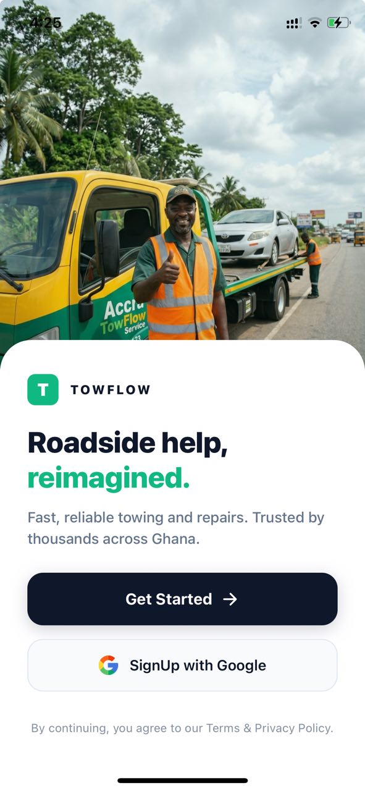
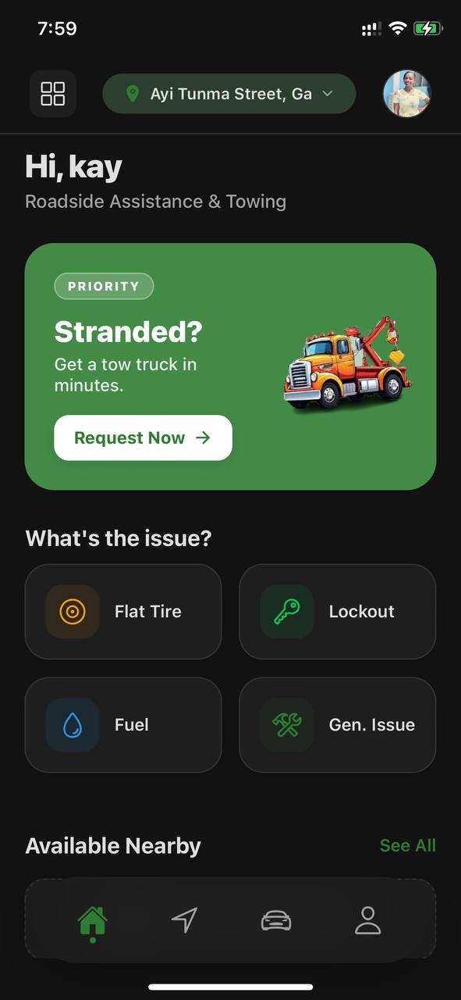
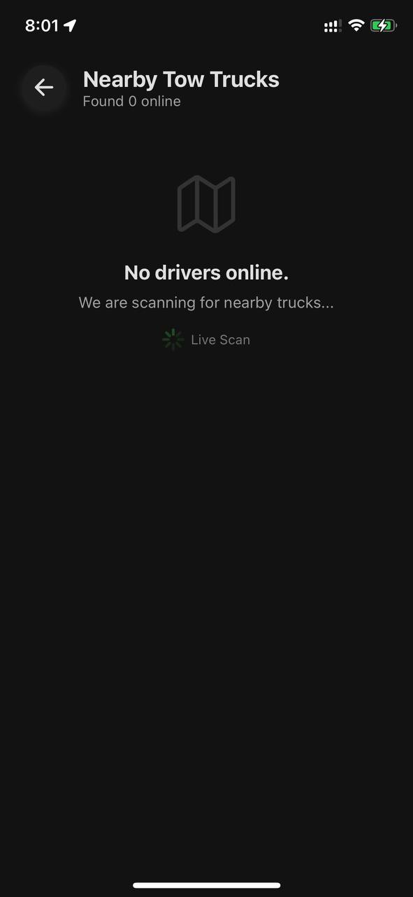

---

### 🔧 Service Selection

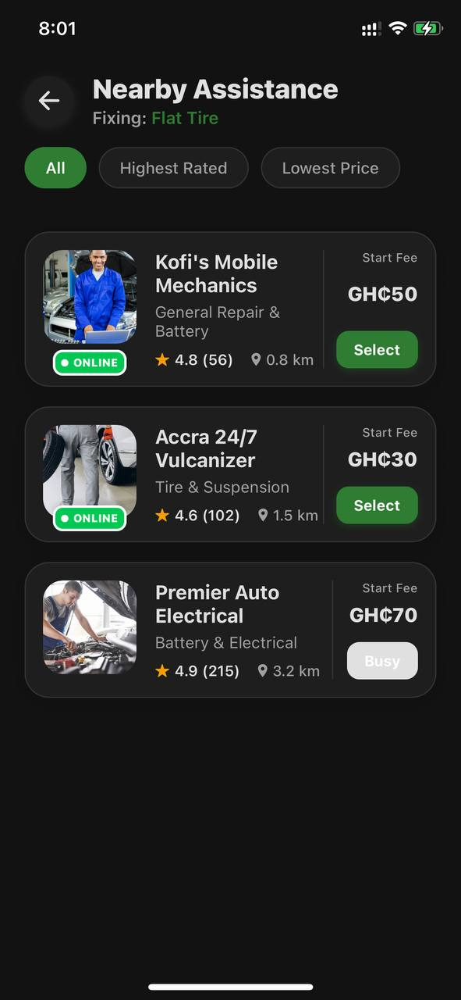

---

### 🚗 Vehicle Management

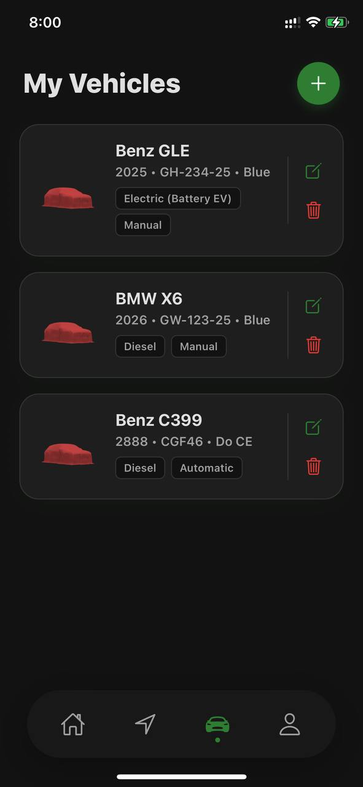

---

### 📍 Live Tracking

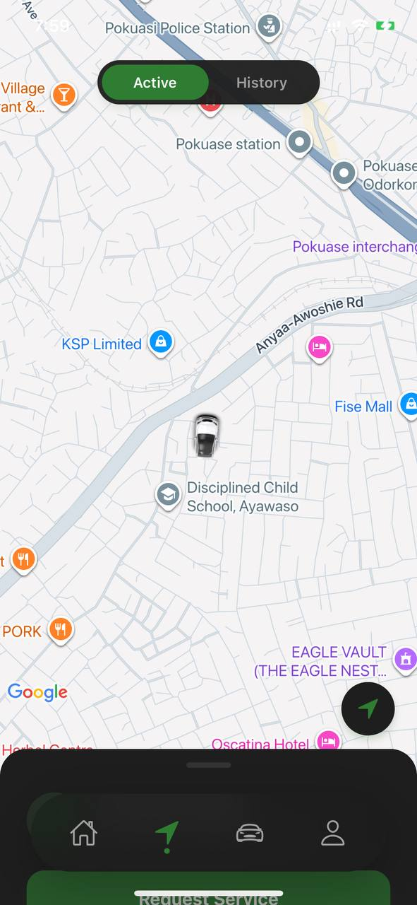

---

### 👤 Profile & Settings

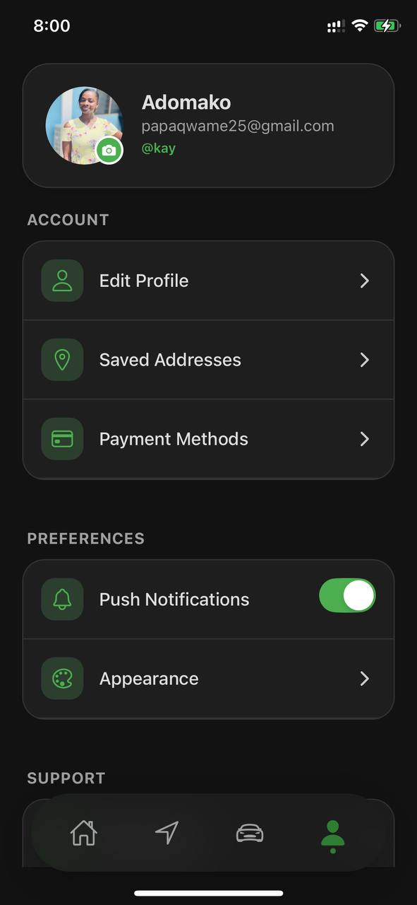
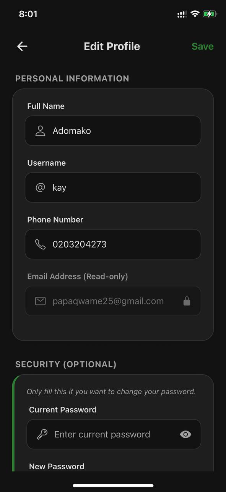

---

### 🆘 Support System

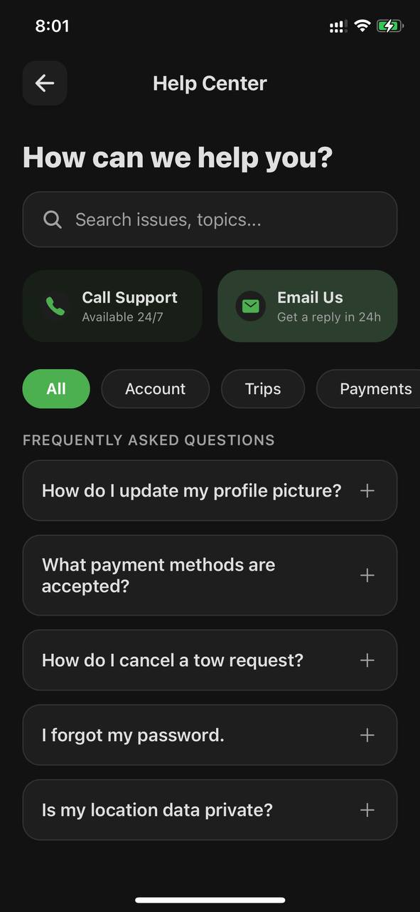

---

## 🔄 User Workflow

1. Select issue (flat tire, fuel, etc.)
2. System finds nearby drivers
3. Request is sent
4. Driver is assigned
5. Real-time tracking begins
6. Service completed

---

# 📱 Driver App (In Development)

---

### 🚗 Driver Dashboard

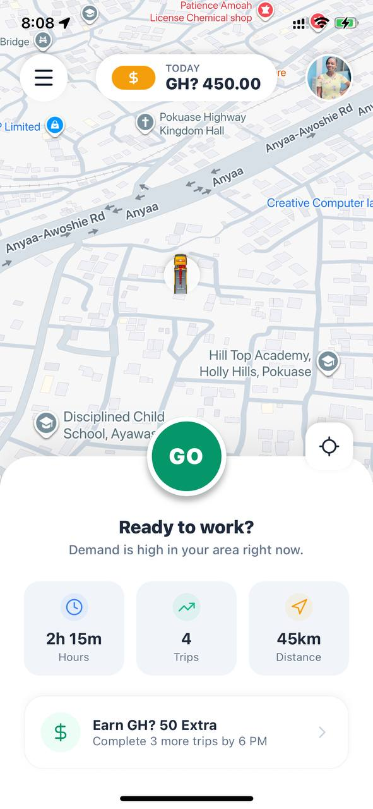
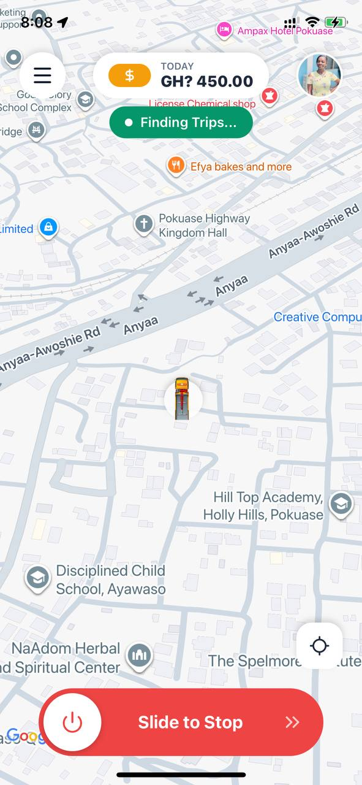

---

### 👤 Profile

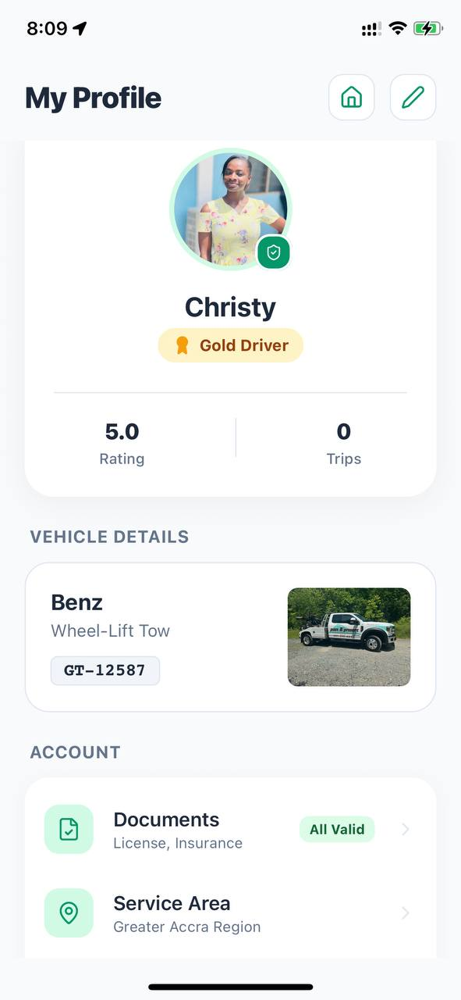
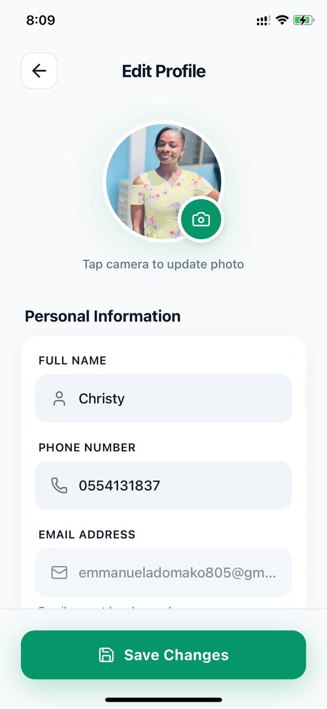

---

### 🚚 Vehicle & Docs

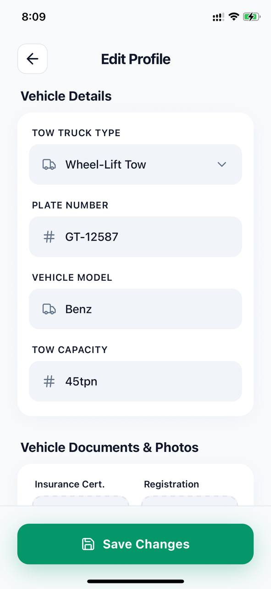
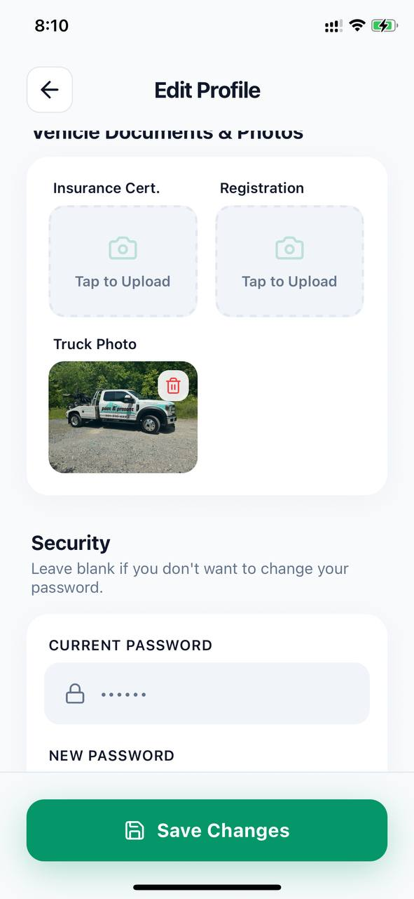

---

### 📋 Menu

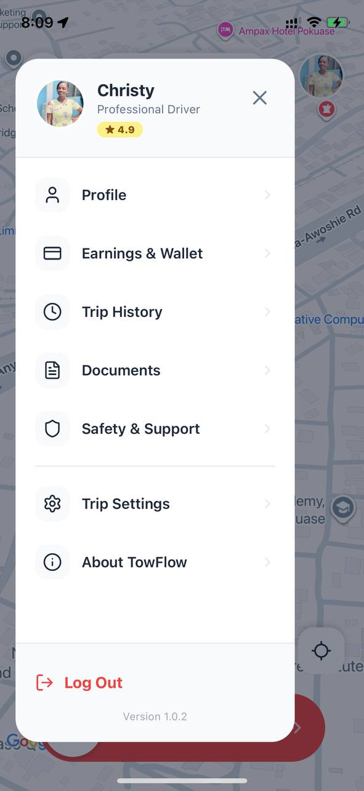

---

## 🔄 Driver Workflow

1. Go online
2. Receive nearby requests
3. Accept job
4. Navigate to user
5. Complete trip

---

# 🧭 System Architecture

```
Mobile Apps (User/Driver)
        ↓
Backend API (Node.js)
        ↓
PostgreSQL Database
        ↓
Realtime Updates (WebSocket Layer)
        ↓
Admin Dashboard (React)
```

---

## 🗄️ Database Design

**Users**

- id, name, email, role

**Drivers**

- id, user_id, status, location

**Vehicles**

- id, driver_id, type

**Requests**

- id, user_id, status

**Trips**

- id, request_id, earnings

---

## 🔌 API Overview

**Base URL:**
http://localhost:5000/api

### Auth

- POST /auth/register
- POST /auth/login

### Requests

- POST /requests
- GET /requests/nearby
- POST /requests/:id/accept

---

## 🛠️ Tech Stack

**Backend**

- Node.js, Express
- PostgreSQL

**Frontend**

- React + Tailwind

**Mobile**

- React Native (Expo)

---

## 🚀 Deployment

- Backend → AWS / Render
- Database → PostgreSQL
- Mobile → Expo
- Web → Vercel

---

## 🔐 Security

- JWT authentication
- Password hashing
- Role-based access control

---

## 📖 Case Study

TowFlow demonstrates:

- Real-time system design
- Full-stack engineering
- Mobile + backend integration
- Scalable architecture thinking

---

## 🔮 Roadmap

- AI-based driver allocation
- Predictive demand analytics
- Payment system (MoMo) — UI completed, backend integration pending
- Multi-region scaling

---

## 📌 Status

🚧 Actively under development

---

## 👨‍💻 Author

**Adomako Emmanuel**
Full-stack Developer | Systems Builder
